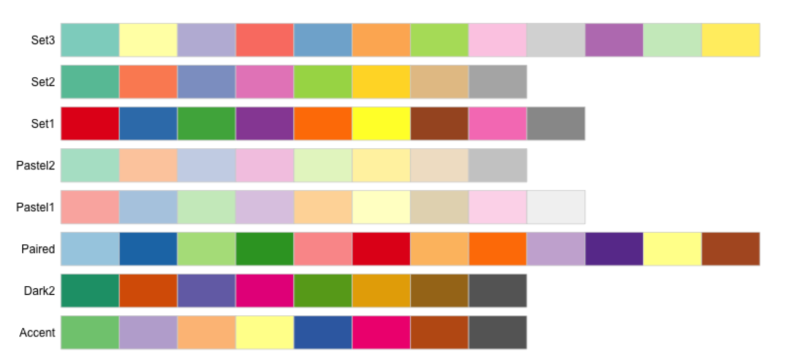
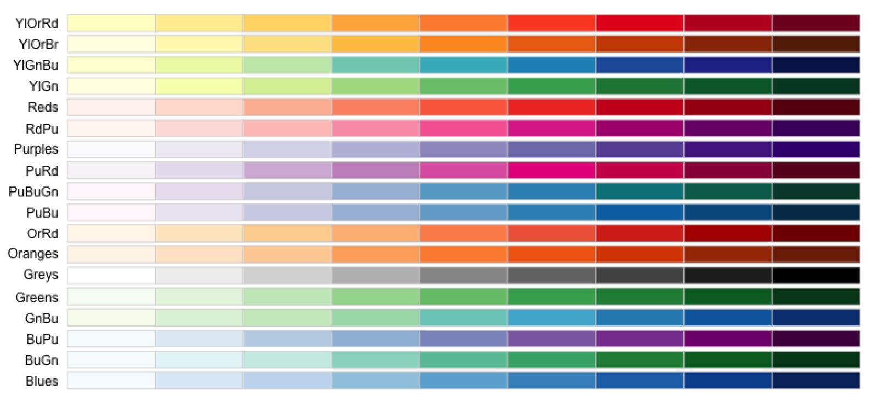
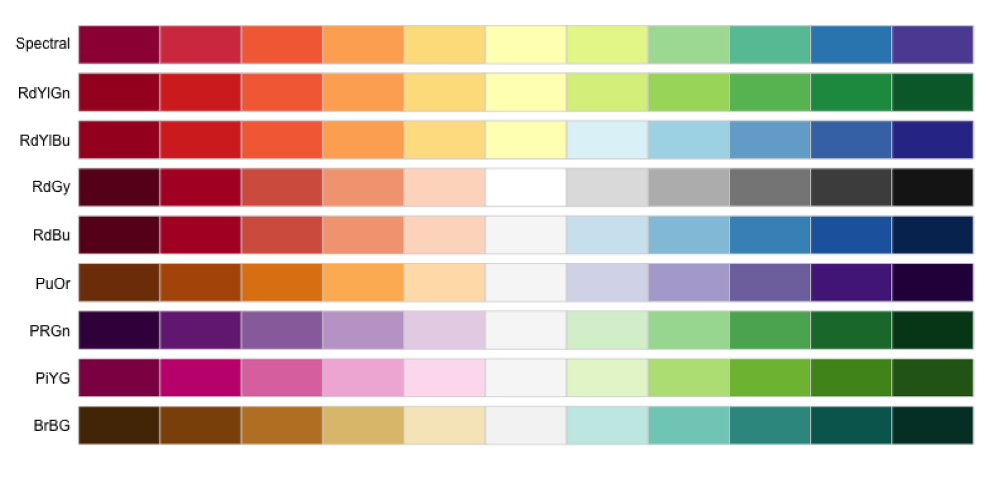

### Why would we use colour in plots?

2D plots are more understandable than 3D plots. Colour and/or shape will be additional dimension(s) in the plot.

It's simple -- just add `colour = z` or `shape = z` within `aes()`.

### Colour or Shape?

Colour is more frequently used than shape, because human's eyes are more sensitive to colours than shapes. If there are more than 3 levels of the variable, shapes are less useful than colours.

### Be careful about colours

When there are too many levels of a variable, we should be careful because the choice of colour is a major factor in creating effective charts. We should also consider colour blind people. A good set of colours will highlight the story you want the data to tell, while a poor one will hide or distract from a visualisation’s purpose. In conclusion, colours in plots can be a big topic -- it can be very complex, so, we will not discuss too much about colour selections here.

#### Different types of colour

**Qualitative: categorical variables**

**Sequential: low to high numeric values**

**Diverging: negative to positive values**

                 
                 
#### [Useful tool of colour selection](https://colorbrewer2.org/#type=sequential&scheme=BuGn&n=3)

