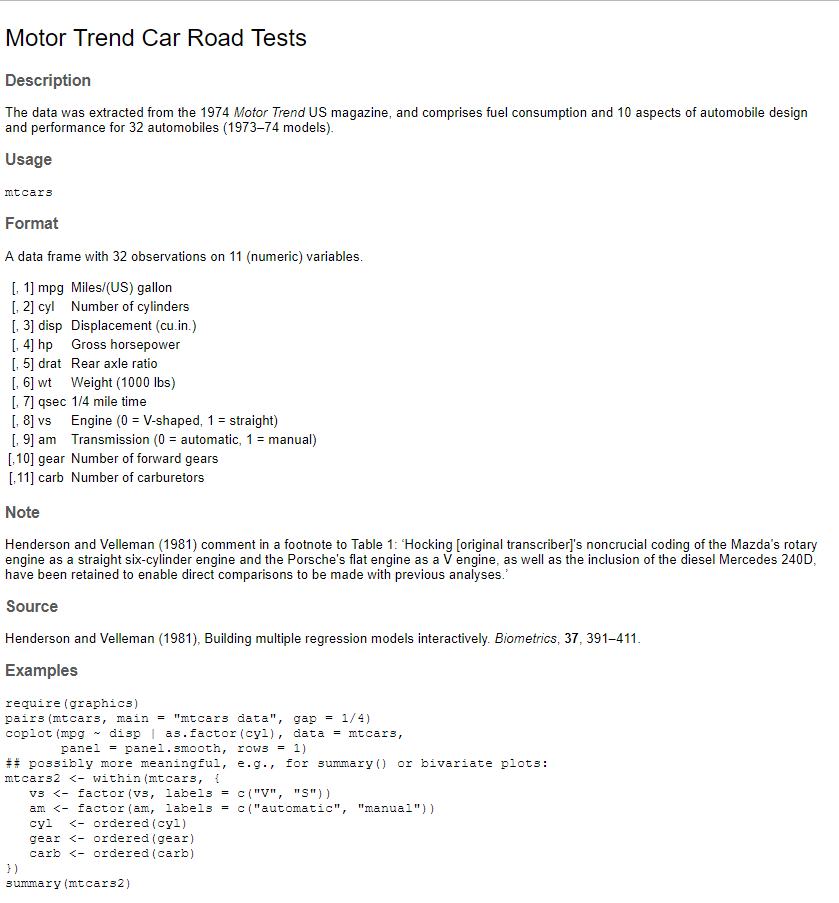
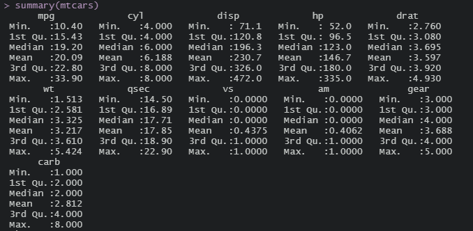

A data set has its own characteristics : observations (rows), variables (columns), variables types, and missing values.

For a data set built in a package, it has description about its data source and variables.

### First,
Try to type `?mtcars` in the console
In your help panel will show the same thing as the screenshot below

This step is important before drawing any plots, because different types of plots are suitable for different types of variable.

### Second,
Use `skimr::skim()` or `summary()` function to have a first look of your data.

### Let's start with an easy example
